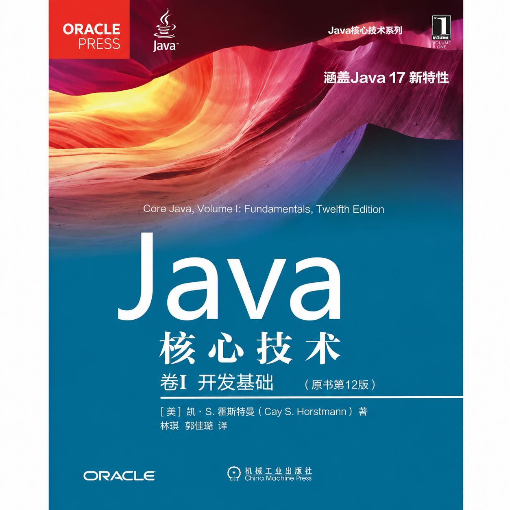

# OOP Java — 2026 Spring

Object-Oriented Programming (Java) course notes and code.

This is a **bilingual** course (Chinese & English). All lecture slides, exams, and code are in English.

This is the textbook for the course:


## Structure

```plaintext
├── README.md
├── lecture1/
│   ├── README.md             # Lecture 1 documentation
│   ├── lecture1note.md       # Unit 1.1 — Java Applications (notes)
│   ├── image.png             # Java platform architecture diagram
│   ├── image-1.png           # Java platform version evolution
│   └── src/
│       ├── HelloWorld.java   # First Java program
│       └── HelloWorld.class  # Compiled bytecode
├── lecture2/
│   ├── README.md             # Lecture 2 documentation
│   ├── lecture2note.md       # Unit 1.1.3 & 1.1.4 (notes)
│   ├── Review.md             # Quick-reference review
│   ├── Test.java             # Package & import demo
│   ├── StringTest.java       # String class methods demo
│   ├── ProductInfo.java      # StringTokenizer + Wrappers demo
│   ├── WrapperExample.java   # Boxing/unboxing demo
│   ├── ConsoleIOExample.java # BufferedReader + PrintWriter demo
│   ├── PrintTester.java      # printf() file reader demo
│   └── examples/             # Scanner/BufferedReader comparison + Regex split
├── lab10/
│   ├── README.md             # Design Patterns: Singleton & Strategy
│   ├── SampleCode/           # In-class Borrower examples
│   ├── student-files/        # Gourmet Coffee System (main project)
│   └── docs/                 # Original assignment materials + screenshots
└── lab11/
    ├── README.md             # File I/O in the Gourmet Coffee System
    ├── docs/                 # Assignment materials + screenshots
    └── student-files/        # File I/O version (main project)
```

## Contents

### Lecture 1 — Java Basics

- Java compilation and execution workflow (`.java` → `javac` → `.class` → `JVM`)
- Java platform editions: Java SE, Jakarta EE, legacy platform overview
- Key differences between Java and C (OOP paradigm, type system, memory management)
- Writing and running a HelloWorld application

### Lecture 2 — Java API & Console I/O

- **Java API & Packages** — organizing classes with packages, import declarations, fully qualified names
- **String Class** — constructors, key methods (`length`, `charAt`, `equals`, `indexOf`, `startsWith`, `substring`), `==` vs. `equals()`
- **StringTokenizer** — tokenizing strings with custom delimiters
- **Wrapper Classes** — boxing/unboxing, autoboxing, type conversion (`Integer.parseInt`, `Double.parseDouble`), performance considerations
- **Console I/O** — `BufferedReader`, `PrintWriter`, `Scanner` vs. `BufferedReader`, `printf()` formatting
- **String.split() with regex** — delimiters, special character escaping, digit extraction, limit parameter

See `lecture2/README.md` for full documentation and run instructions.

### Lab 10 — Design Patterns: Singleton & Strategy

- **Gourmet Coffee System** — a Java console application for formatting sales data
- **Strategy Pattern** — interchangeable output formats (Plain Text, HTML, XML) via a common `SalesFormatter` interface
- **Singleton Pattern** — each formatter uses a private constructor with a static `getSingletonInstance()` factory method
- **Modern Java features** — Generics, StringBuilder, switch expressions, `@FunctionalInterface`, `System.lineSeparator()`

See `lab10/README.md` for full documentation.

### Lab 11 — File I/O in the Gourmet Coffee System

- **Gourmet Coffee System with File I/O** — extends Lab 10 by loading product data from `catalog.dat` instead of hard-coding it
- **File input** — `FileCatalogLoader` parses underscore-delimited product/coffee/brewer records using `BufferedReader` + `StringTokenizer`
- **File output** — sales reports can be saved to files in Plain Text, HTML, or XML format via `GourmetCoffee.writeFile()`
- **Error handling** — custom `DataFormatException` for malformed data; `FileNotFoundException` and `IOException` at the I/O layer
- **Design patterns** — Strategy and Singleton patterns from Lab 10 are reused for output formatting
- **Testing** — `TestFileCatalogLoader` provides automated verification of file parsing

See `lab11/README.md` for full documentation.

## Requirements

- JDK 17+
- Any Java IDE (IntelliJ IDEA or VS Code recommended)

## Run

```bash
# Lecture 1
cd lecture1/src
javac HelloWorld.java
java HelloWorld

# Lecture 2 — Java API & I/O
cd lecture2
javac StringTest.java && java StringTest
javac ConsoleIOExample.java && java ConsoleIOExample
javac PrintTester.java && java PrintTester test.txt
```
