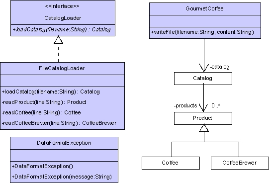
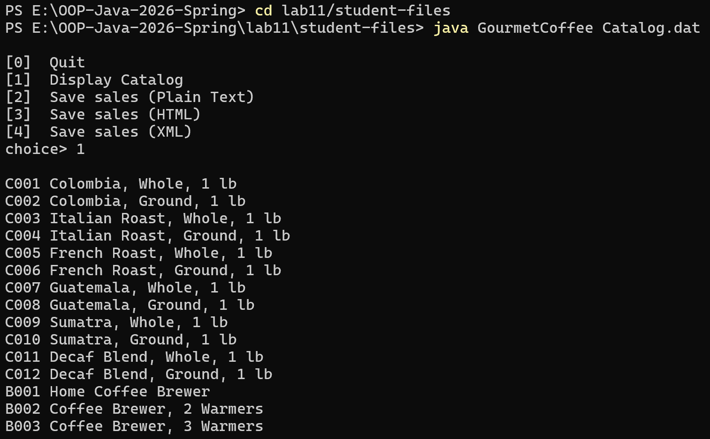
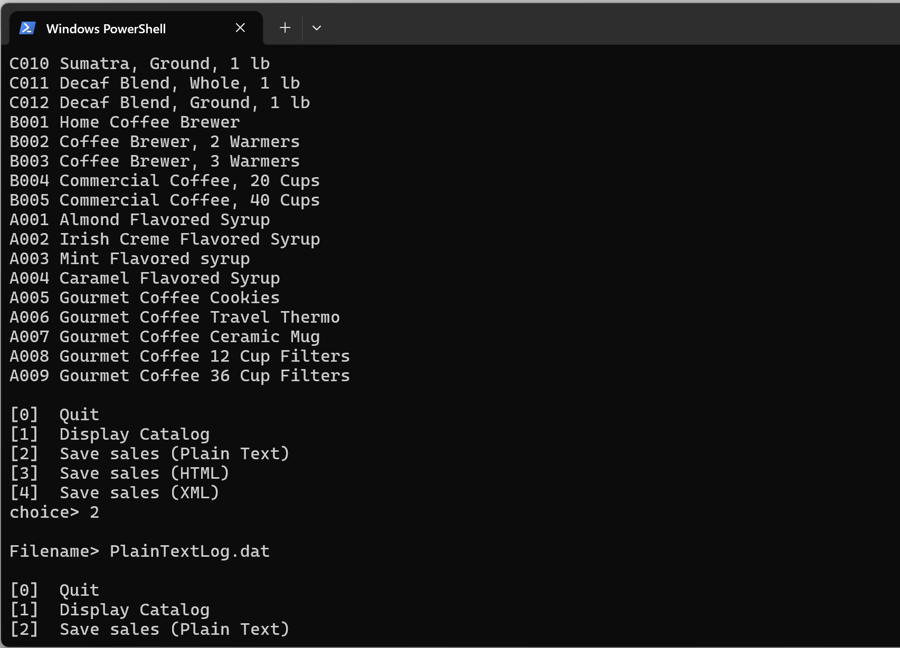
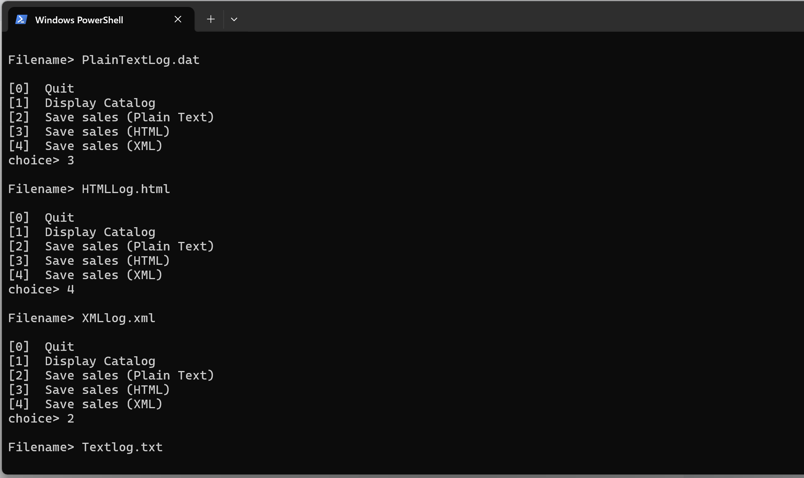
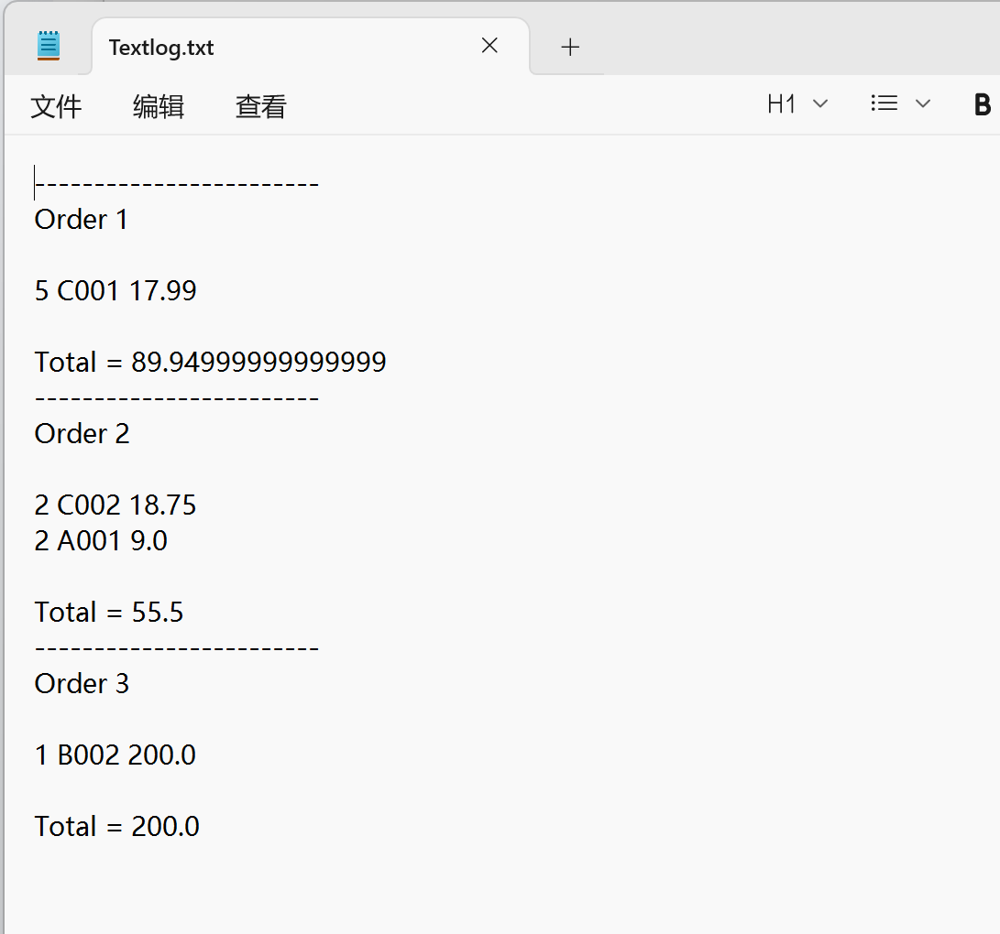
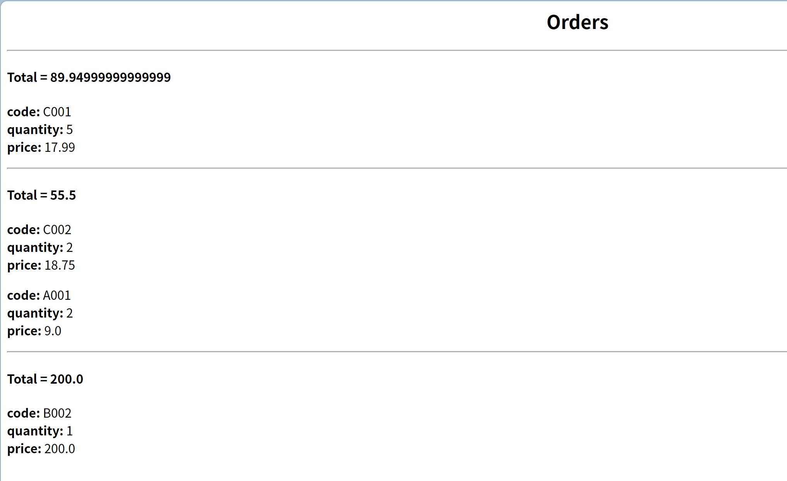
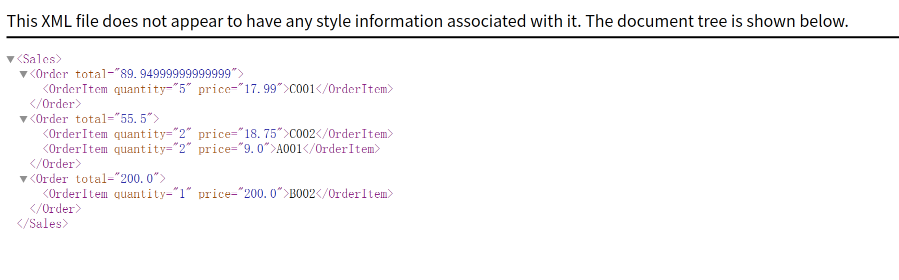

# Lab 11 — File I/O in the Gourmet Coffee System

## Overview

This lab extends the **Gourmet Coffee System** from Lab 10 by replacing hard-coded product data with file-based loading and adding file output for sales reports.

- **File Input** — product catalog is loaded from `catalog.dat` using `BufferedReader` and `StringTokenizer`
- **File Output** — sales information can be saved to files in Plain Text, HTML, or XML format
- **Strategy Pattern** — interchangeable output formats via the `SalesFormatter` interface (inherited from Lab 10)
- **Singleton Pattern** — each formatter class has a single instance (inherited from Lab 10)

## Architecture

```
┌─────────────────────────────────────────────────────────────────┐
│                     CatalogLoader                               │
│                     <<interface>>                               │
│         + loadCatalog(String) : Catalog                         │
└───────────────────────────┬─────────────────────────────────────┘
                            │ implements
                ┌───────────▼──────────────┐
                │   FileCatalogLoader      │
                │──────────────────────────│
                │ - readProduct(String)    │
                │ - readCoffee(String)     │
                │ - readCoffeeBrewer(String)│
                └──────────────────────────┘
                            │ uses
                ┌───────────▼──────────────┐
                │       Catalog            │
                │──────────────────────────│
                │   + Product objects      │
                └──────────────────────────┘

┌─────────────────────────────────────────────────────────────────┐
│                      SalesFormatter                             │
│                      <<interface>>                              │
│                      + formatSales(Sales) : String              │
└──────────────────────────┬──────────────────────────────────────┘
                           │
           ┌───────────────┼───────────────┐
           │               │               │
┌──────────▼────────┐ ┌───▼────────┐ ┌───▼─────────┐
│PlainTextSales     │ │HTMLSales   │ │XMLSales      │
│Formatter          │ │Formatter   │ │Formatter     │
├───────────────────┤ ├────────────┤ ├──────────────┤
│(Singleton)        │ │(Singleton) │ │(Singleton)   │
└───────────────────┘ └────────────┘ └──────────────┘
```

## Inheritance Hierarchy

```
Product
├── Coffee        (origin, roast, flavor, aroma, acidity, body)
└── CoffeeBrewer  (model, waterSupply, numberOfCups)
```



## File Structure

```
lab11/
├── README.md                         # this file
├── docs/                             # assignment materials & screenshots
│   ├── Exercise 6.html               # original assignment document
│   ├── io-gou-cof.jpg                # class diagram
│   ├── RunGourmetCoffee.png          # program running screenshot
│   ├── RunGourmetCoffee2.png         # saving output screenshot
│   ├── RunGourmetCoffee3.png         # saving output screenshot
│   ├── TextLogtxt.png                # plain text output preview
│   ├── HTMLlog.png                   # HTML output preview
│   └── XMLLog.png                    # XML output preview
└── student-files/                    # main project files
    ├── GourmetCoffee.java            # main application (completed)
    ├── FileCatalogLoader.java        # file parser (implemented from scratch)
    ├── CatalogLoader.java            # interface for catalog loading
    ├── DataFormatException.java      # custom exception for malformed data
    ├── TestFileCatalogLoader.java    # test driver for FileCatalogLoader
    ├── Product.java                  # base product model
    ├── Coffee.java                   # coffee product (extends Product)
    ├── CoffeeBrewer.java             # coffee brewer product (extends Product)
    ├── Catalog.java                  # product catalog (collection of products)
    ├── OrderItem.java                # item in an order
    ├── Order.java                    # single order (collection of items)
    ├── Sales.java                    # collection of paid orders
    ├── SalesFormatter.java           # strategy interface
    ├── PlainTextSalesFormatter.java  # plain text strategy
    ├── HTMLSalesFormatter.java       # HTML strategy
    ├── XMLSalesFormatter.java        # XML strategy
    ├── catalog.dat                   # product data file
    ├── empty.dat                     # empty file for testing
    ├── Textlog.txt / .dat            # sample plain text output
    ├── HTMLLog.html                  # sample HTML output
    ├── XMLlog.xml                    # sample XML output
    └── resources/                    # Javadoc resources
```

## Data File Format (`catalog.dat`)

Lines are underscore-delimited. Three record types:

**Coffee:**
```
Coffee_code_description_price_origin_roast_flavor_aroma_acidity_body
```

**Coffee Brewer:**
```
Brewer_code_description_price_model_waterSupply_numberOfCups
```

**Accessory (Product):**
```
Product_code_description_price
```

## How to Run

```bash
cd student-files
javac GourmetCoffee.java
java GourmetCoffee catalog.dat
```

Menu options:
- `[0]` Quit
- `[1]` Display Catalog
- `[2]` Save sales (Plain Text)
- `[3]` Save sales (HTML)
- `[4]` Save sales (XML)

### Screenshots

| Running the program | Selecting an option |
|---|---|
|  |  |

| Saving output | 
|---|
|  |

### Generated Outputs

| Plain Text | HTML | XML |
|---|---|---|
|  |  |  |

### Running Tests

```bash
cd student-files
javac TestFileCatalogLoader.java
java TestFileCatalogLoader
```

## Key Concepts

### File I/O

- **Reading**: `FileReader` wrapped in `BufferedReader` for line-by-line reading
- **Parsing**: `StringTokenizer` splits underscore-delimited fields; `Double.parseDouble` / `Integer.parseInt` for numeric fields
- **Writing**: `FileWriter` wrapped in `PrintWriter` for writing formatted output
- **Exception handling**: `FileNotFoundException`, `IOException`, and custom `DataFormatException` for malformed input

### CatalogLoader

The `CatalogLoader` interface abstracts product catalog loading:

```java
public interface CatalogLoader {
    Catalog loadCatalog(String fileName)
        throws FileNotFoundException, IOException, DataFormatException;
}
```

### FileCatalogLoader

Implemented from scratch to parse `catalog.dat`:

- `readProduct()` — parses 4-field accessory lines
- `readCoffee()` — parses 10-field coffee lines
- `readCoffeeBrewer()` — parses 7-field brewer lines
- `loadCatalog()` — orchestrates reading, dispatches by line prefix (`startsWith`)

### GourmetCoffee.writeFile()

Creates a new file and writes formatted sales content:

```java
private void writeFile(String filename, String content)
    throws IOException {
    PrintWriter writer = new PrintWriter(new FileWriter(filename));
    writer.print(content);
    writer.close();
}
```

## Comparison: Lab 10 vs Lab 11

| Feature | Lab 10 | Lab 11 |
|---|---|---|
| Product data | Hard-coded in `GourmetCoffee` | Loaded from `catalog.dat` |
| File output | N/A (displayed to console) | Written to file via `writeFile()` |
| Program args | No arguments | `java GourmetCoffee catalog.dat` |
| New types | — | `CatalogLoader`, `FileCatalogLoader`, `DataFormatException` |
| Test driver | — | `TestFileCatalogLoader` |
