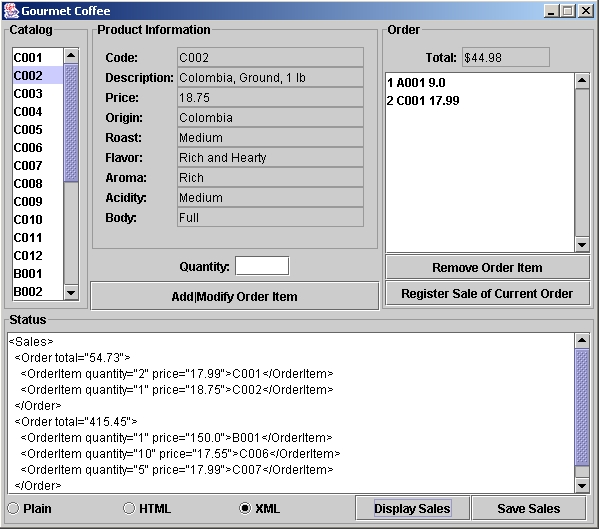

# Lab 12 — GUI for the Gourmet Coffee System

## Overview

This lab adds a **Swing-based graphical user interface** to the Gourmet Coffee System. It is split into two parts:

- **Exercise 7** — Implements `getPanel()` methods in `Product`, `Coffee`, and `CoffeeBrewer` to display product details in a structured Swing panel
- **Exercise 8** — Builds a complete interactive GUI (`GourmetCoffeeGUI`) with catalog browsing, order management, and sales tracking

The GUI is built with **Swing components** (`JList`, `JPanel`, `JTextArea`, `JButton`, `JRadioButton`, `JFileChooser`, etc.) and uses **event-driven programming** via `ActionListener` and `ListSelectionListener` inner classes.

---

## Architecture

### Exercise 7 — Product Information Panels

Each domain class now has a `getPanel()` method that returns a `JPanel` with labeled text fields showing its attributes:

```
Product.getPanel()          Coffee.getPanel()            CoffeeBrewer.getPanel()
┌────────────────────┐     ┌────────────────────┐       ┌──────────────────────┐
│ Code:   C001       │     │ Code:    C001      │       │ Code:    B002        │
│ Desc:   ...        │     │ Desc:    ...       │       │ Desc:    ...         │
│ Price:  17.99      │     │ Price:   17.99     │       │ Price:   200.00      │
└────────────────────┘     │ Origin:  Colombia  │       │ Model:   Brewer 200  │
                           │ Roast:   Medium    │       │ Water:   Pourover    │
                           │ Flavor:  Rich...   │       │ Cups:    12          │
                           │ ...                │       └──────────────────────┘
                           └────────────────────┘
```

### Exercise 8 — Full GUI Layout

```
┌─────────────────────────────────────────────────────────────────┐
│  ┌────────────┐  ┌──────────────────────┐  ┌────────────────┐  │
│  │  Catalog   │  │ Product Information  │  │    Order       │  │
│  │            │  │                      │  │                │  │
│  │ ├ C001     │  │  Code:  C001        │  │ ├ 5 C001 17.99 │  │
│  │ ├ C002     │  │  Desc:  Colombia... │  │ ├ 2 A001 9.0   │  │
│  │ ├ C003     │  │  Price: $17.99      │  │ │              │  │
│  │ ├ ...      │  │                      │  │ │              │  │
│  │ └ C026     │  │                      │  │  Total: $105.95│  │
│  └────────────┘  │  Quantity: [____]    │  │  [Remove]      │  │
│                   │  [Add|Modify Item]  │  │  [Register]    │  │
│                   └──────────────────────┘  └────────────────┘  │
│  ┌──────────────────────────────────────────────────────────────┐│
│  │  Status                                                     ││
│  │  ┌────────────────────────────────────────────────────────┐ ││
│  │  │ Product C001 has been displayed                        │ ││
│  │  └────────────────────────────────────────────────────────┘ ││
│  │  (Plain) (HTML) (XML) [Display Sales] [Save Sales]         ││
│  └──────────────────────────────────────────────────────────────┘│
└─────────────────────────────────────────────────────────────────┘
```

### Class Diagram



---

## File Structure

```
lab12/
├── README.md                             # this file
├── docs/                                 # assignment materials & screenshots
│   ├── Exercise 7.html                   # Exercise 7 assignment document
│   ├── Exercise 8.html                   # Exercise 8 assignment document
│   ├── catalog-gui-cof-gou.jpg           # CatalogGUI screenshot (Ex7)
│   ├── uml-catalog-gui.jpg               # UML diagram for Ex7
│   ├── gou-cof-cmpl.jpg                  # Full GUI class diagram (Ex8)
│   ├── GUI.png                           # application screenshot
│   ├── exe-gourmet-coffee-gui.jar        # sample executable (Ex8)
│   ├── student-files_ex7.zip             # student template files (Ex7)
│   └── student-files_ex8.zip             # student template files (Ex8)
└── GourmetCoffee/                        # complete project
    ├── GourmetCoffeeGUI.java             # main GUI application
    ├── Product.java                      # base product + getPanel()
    ├── Coffee.java                       # coffee + getPanel()
    ├── CoffeeBrewer.java                 # coffee brewer + getPanel()
    ├── Catalog.java                      # product catalog + getCodes()
    ├── Order.java                        # order + getItems()
    ├── OrderItem.java                    # item in an order
    ├── Sales.java                        # collection of paid orders
    ├── CatalogLoader.java                # catalog loader interface
    ├── FileCatalogLoader.java            # catalog file parser
    ├── DataFormatException.java          # custom exception
    ├── SalesFormatter.java               # strategy interface
    ├── PlainTextSalesFormatter.java      # plain text strategy
    ├── HTMLSalesFormatter.java           # HTML strategy
    ├── XMLSalesFormatter.java            # XML strategy
    ├── catalog.dat                       # product data file
    └── resources/                        # Javadoc resources
```

---

## How to Run

```bash
cd GourmetCoffee
javac -encoding UTF-8 GourmetCoffeeGUI.java
java GourmetCoffeeGUI catalog.dat
```

If no filename is given, `catalog.dat` is used by default.

### GUI Operations

| Component | Description |
|---|---|
| **Catalog list** (left) | Click a product code to view its details |
| **Quantity field** | Enter the quantity before adding to order |
| **Add\|Modify Order Item** | Adds a new item or updates quantity if already in order |
| **Remove Order Item** | Removes the selected item from the current order |
| **Register Sale** | Finalizes the current order into sales |
| **Display Sales** | Shows all registered sales in the status area |
| **Save Sales** | Saves sales to a file (file chooser dialog) |
| **Plain / HTML / XML** | Radio buttons to select output format |

---

## Key Concepts

### Swing Components Used

- **`JList<String>`** — displays product codes (catalog) and order items (order)
- **`JPanel`** — container for product details, swapped dynamically via `getPanel()`
- **`JTextArea`** — status area for messages and sales output
- **`JButton`** — triggers actions (add, remove, register, display, save)
- **`JRadioButton`** — selects output format (Plain/HTML/XML)
- **`JFileChooser`** — file selection dialog for saving sales
- **`GridBagLayout`** — flexible layout for product detail panels

### Event Handling

Events are handled via named inner classes implementing `ActionListener` or `ListSelectionListener`:

```java
class AddModifyListener implements ActionListener {
    @Override
    public void actionPerformed(ActionEvent event) {
        // validate input, add or modify order item
    }
}
```

### Product Information Panel

The `getPanel()` pattern lets each product class define its own visual representation:

```java
// In Product.java
public JPanel getPanel() {
    JPanel panel = new JPanel(new GridBagLayout());
    // ... add labeled text fields for each attribute
    return panel;
}
```

The panel is swapped dynamically when the user selects a different product:

```java
productPanel.removeAll();
productPanel.add(product.getPanel());
productPanel.revalidate();
productPanel.repaint();
```

### File I/O (Save Sales)

Uses `JFileChooser` for interactive file selection and `try-with-resources` for safe file writing:

```java
int result = fileChooser.showSaveDialog(GourmetCoffeeGUI.this);
if (result == JFileChooser.APPROVE_OPTION) {
    try (PrintWriter writer = new PrintWriter(new FileWriter(file))) {
        writer.print(salesFormatter.formatSales(sales));
    }
}
```

---

## Modern Java Features

All model and UI classes have been modernized:

| Feature | Usage |
|---|---|
| **Generics** | `List<Product>`, `List<OrderItem>`, `JList<String>` |
| **Enhanced for-loop** | replaces raw `Iterator` in data access |
| **`StringBuilder`** | efficient string building in formatters |
| **`@FunctionalInterface`** | marks `SalesFormatter` |
| **`try-with-resources`** | safe file I/O in `FileCatalogLoader` and `SaveSalesListener` |
| **`GridBagLayout`** | clean panel layout for product details |
| **`System.lineSeparator()`** | portable newline constant |

---

## Comparison: Lab 11 vs Lab 12

| Feature | Lab 11 | Lab 12 |
|---|---|---|
| Interface | Console (menu-based) | Swing GUI |
| Catalog display | Text list | `JList` with detail panel |
| Order management | Hard-coded sample orders | Interactive add/modify/remove |
| Sales output | Command-line file save | `JFileChooser` dialog |
| Product details | N/A | `getPanel()` per product type |
| Event handling | N/A | `ActionListener` inner classes |
