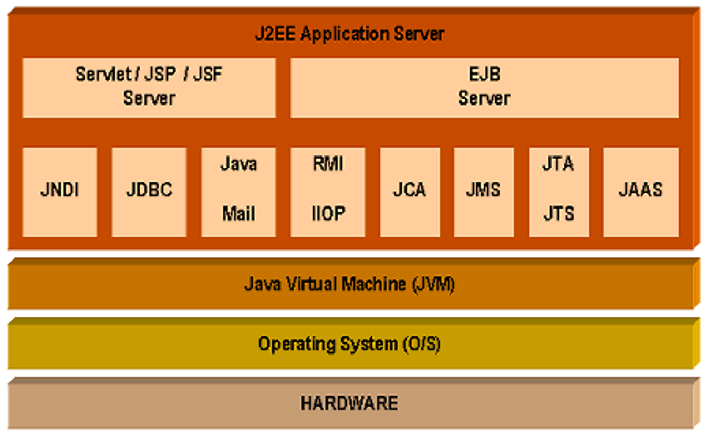
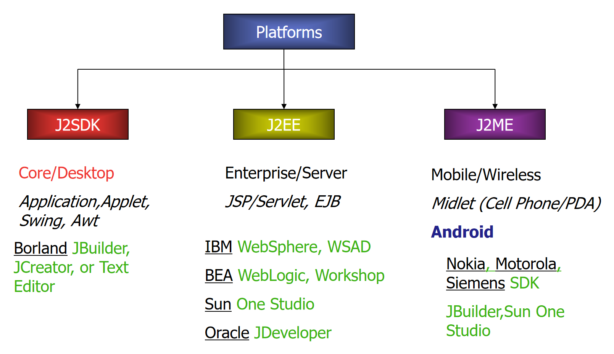

# Unit 1.1 Java Applications

## 1.1.1 Applications in Java

### 1. Java Basic

- JAVA source code is first written in plain text files ending with the .java extension.
- Those source files are then compiled into .class files by the Java compiler (javac).
  - A .class file does not contain code that is native to your processor;
  - Instead, it contains bytecode, which is a set of instructions that can be executed by the Java Virtual Machine (JVM).
- The Java launcher tool (java) then runs your application with an instance of the Java Virtual Machine.

This is a simple Java application that prints "Hello, World!" to the console:

```java
public class HelloWorld {
    public static void main(String[] args) {
        System.out.println("Hello, World!");
    }
}
```

You can compile and run this application using the following commands in your terminal:

```bash
javac HelloWorld.java
java HelloWorld
```

When you run the `java HelloWorld` command, the JVM executes the bytecode in the HelloWorld.class file, which results in the output "Hello, World!" being printed to the console.

### 2. Java Platform

- The Java platform has two components：
  - The Java Virtual Machine (JVM) is the runtime environment that executes Java bytecode. It provides a platform-independent way to run Java applications, as the same bytecode can be executed on any device that has a compatible JVM.
    > Java bytecode is an intermediate language which is typically compiled from Java, but it can also be compiled from other programming languages. For example, Ada source code can be compiled to Java bytecode and executed on a JVM.
  - The Java Application Programming Interface (API) is a large collection of pre-written classes and interfaces that provide functionality for various tasks, such as input/output operations, data structures, networking, and more. The API allows developers to use existing code to perform common tasks without having to write everything from scratch.



> Actually, nearly all the original J2 platform architecture from this diagram has been rebranded, replaced, or deprecated over the past 20+ years.

#### 1.J2SDK → Java SE (Java Platform, Standard Edition)

The `J2SDK` name was officially retired after Java 5 (2004), renamed to **Java SE** (Java Platform, Standard Edition).

- **Deprecated components:** Applet is fully removed from Java 17+; AWT/Swing are legacy UI toolkits, largely replaced by JavaFX, web frameworks, or native desktop stacks.
- **Current status:** Java SE remains the core foundation of the entire Java ecosystem, with massive modern upgrades (modules in Java 9, records, pattern matching, virtual threads, etc.) and active long-term support (LTS releases every 2-3 years).
- **Legacy tools:** Old IDEs like Borland JBuilder, JCreator are obsolete, replaced by IntelliJ IDEA, Eclipse, and VS Code.

#### 2.J2EE → Jakarta EE (and Jakarta EE 9/10/11)

The `J2EE` name was replaced by **Java EE** in 2006, then transferred to the Eclipse Foundation in 2017 and rebranded to **Jakarta EE**.

- **Deprecated components:** EJB (Enterprise JavaBeans) is now a legacy technology, almost entirely replaced by lightweight frameworks like Spring Boot, Quarkus, and Micronaut.
- **Current status:** Jakarta EE is the modern evolution, with JSP/Servlet still supported but often used as underlying technology for modern REST APIs, reactive web stacks, and cloud-native applications.
- **Legacy servers:** Commercial servers like IBM WebSphere, BEA WebLogic are now niche legacy products; the industry has moved to lightweight, cloud-native runtimes (embedded servers, Kubernetes, serverless).

#### 3.  **J2ME → Fully Deprecated & Obsolete**

`J2ME` is functionally **dead and obsolete** in the modern industry:

- The original use case (feature phone/PDA Midlet apps) was completely wiped out by the rise of iOS and Android in the late 2000s.
- **Android** is not a J2ME platform: it uses a completely different runtime (Dalvik/ART) and SDK, with no relation to the original J2ME stack.
- The few remaining embedded Java use cases now use Java SE Embedded or specialized IoT runtimes, not the original J2ME specification.
- All the listed old mobile SDKs (Nokia, Motorola, Siemens) are long-discontinued legacy products.

### 3. Difference between Java and C

- Java is derived from C, Many of its syntactic characteristics are similar to C. However, there are some huge differences

|C|Java|
|---|---|
|Variable|Attribute|
|Function|Method|
|Struct|Class|
|Pointer|Reference|

> In Java, there are no pointers, and all objects are accessed through references. This means that you cannot directly manipulate memory addresses as you can in C. Instead, Java provides a more secure and managed environment for memory management, which helps prevent common programming errors such as buffer overflows and memory leaks.

- C is not object-oriented, while Java is a fully object-oriented programming language. In C, you can write procedural code that does not involve objects, whereas in Java, everything is an object (except for primitive data types).

#### Expressions

- Arithmetic operators are the same:
	`+, –, *, /, %, ++, ––`
- Numerical type conversion is mostly the same:
  - Java spells out divide by zero, NaN (Not a Number, etc.)
  - C & C++ are machine dependent

#### Relational operators

- Relational operators work the same way but return different results:
  - In C, relational operators return an integer (0 for false, non-zero for true).
  - In Java, relational operators return a boolean value (true or false).

#### Primitive types

- The C language provides many basic types. Most of them are formed from one of the four basic arithmetic type identifiers in C ( `char`, `int`, `float` and `double` ), and optional specifiers ( `signed`, `unsigned`, `short`, `long` ).
- The actual size of integer types varies by implementation. The only guarantee is that the `long long` is not smaller than `long`, which is not smaller than `int`, which is not smaller than `short`.
- Java has a fixed set of primitive types with specific sizes:
  - `byte` (8 bits), `short` (16 bits), `int` (32 bits), `long` (64 bits)
  - `float` (32 bits), `double` (64 bits)
  - `char` (16 bits, representing Unicode characters)
  - `boolean` (true or false)

#### Classes instead of structures

- In C, you can define a structure using the `struct` keyword, which is a collection of variables (of different types) grouped together under a single name. However, C does not support object-oriented programming concepts like classes, inheritance, or polymorphism.

#### Type aliasing

- In C, you can create type aliases using the `typedef` keyword, which allows you to define a new name for an existing type. This can be useful for improving code readability or creating more meaningful type names.

```c
typedef struct {
    int x;
    int y;
} Point;
```

- In Java, there is no direct equivalent to `typedef`.

#### Preprocessing

- C has a preprocessor that allows for macro definitions, conditional compilation, and file inclusion. This can lead to complex code and potential issues with debugging and maintenance.

```c
#include <stdio.h>
#define MAX_SIZE 100
```

#### Global variables

```c
extern int globalVariable; // Declaration of a global variable
```

```java
public class MyClass {
    public static int globalVariable; // Declaration of a global variable
}
```

- There is no attribute  definition outside class in Java. Java is a pure object-oriented programming language. (attribute/method)

### 4. Run a Java program

- Open "Notepad" (Start -> Programs -> Other -> Notepad)
- type the following code into the Notepad window:

```java
public class HelloWorld {
 //This line announces that the program (class) can be run by anyone (public), is called MyApplication.
    public static void main(String[] args) {
      //This line declares a main method.  It has one input argument. The operating system begins execution by calling main.
        System.out.println("Hello, World!");
        //This line tells the computer to display some text ( a string) on the screen.
    }
}
```

- Sava as "HelloWorld.java" (File -> Save As -> HelloWorld.java)
- Open a command prompt (Start -> Programs -> Accessories -> Command Prompt)
- Change to the directory where you saved the file (e.g., `cd C:\Users\YourName\Desktop`)
- Compile the Java program using the command: `javac HelloWorld.java`
- Run the compiled Java program using the command: `java HelloWorld`

> If you run `dir HelloWorld*` in the command prompt, you should see both `HelloWorld.java` and `HelloWorld.class` files. The `.java` file is the source code you wrote, and the `.class` file is the compiled bytecode that the JVM executes.

---

The ppt contains the applet pattern, which is a legacy technology for running Java code in web browsers. Applets are no longer supported in modern browsers due to security concerns and the rise of more modern web technologies (like HTML5, JavaScript frameworks, etc.). Therefore, the applet pattern is considered obsolete and should not be used for new development.

So, we will not cover the applet pattern in this note, and it is recommended to focus on modern Java application development practices instead.

---

### 5. Things to remember

- Everything in Java is **case sensitive** - Paint is not the same as paint.
- The file containing the source code must have the same name as the class it contains and use the .java extension. For instance: MyApplet should match the name of the file MyApplet.java (not myApplication.java).
- Curly brackets `{`and `}` are used to group parts of the program called blocks together. Blocks can be nested inside other blocks but each `{` must be matched with a `}`.
- Most statements require a semi-colon ; at the end. A statement can continue on the next line if necessary.
- Spaces are not important - it is recommended to indent blocks for clarity.

### 6. Java Bytecode

```bash
javac HelloWorld.java
javap -c HelloWorld.class
```